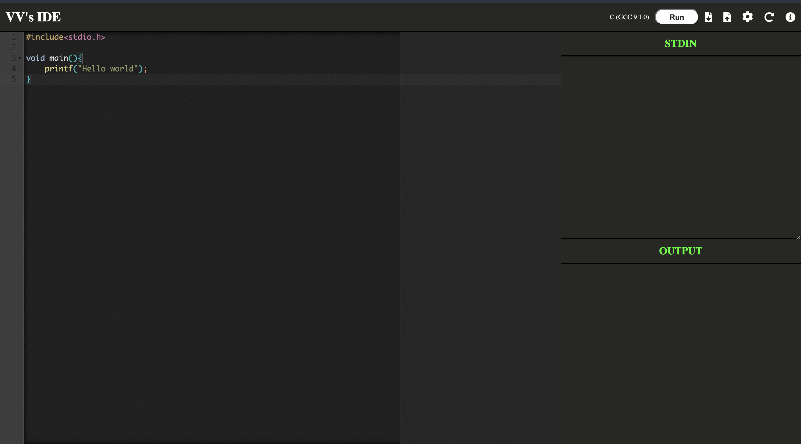
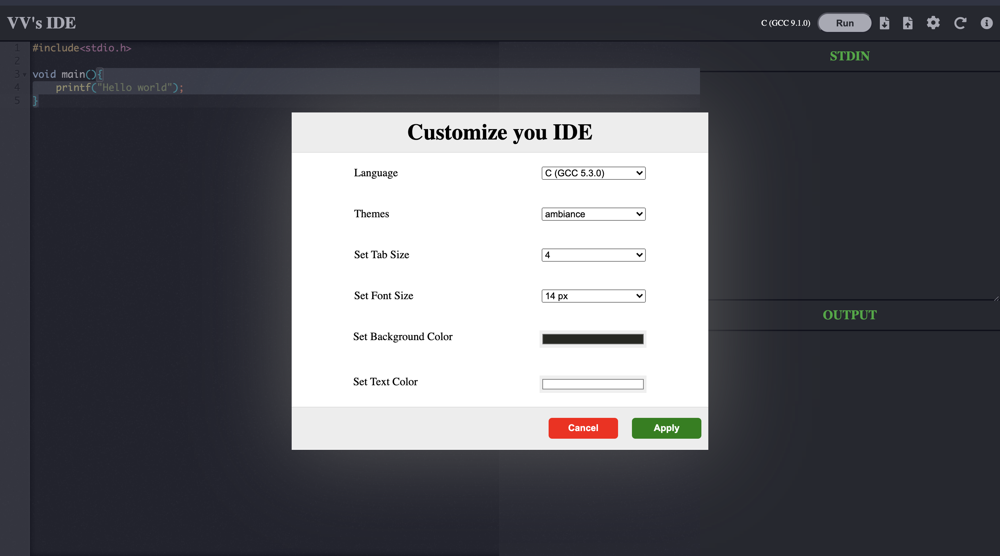
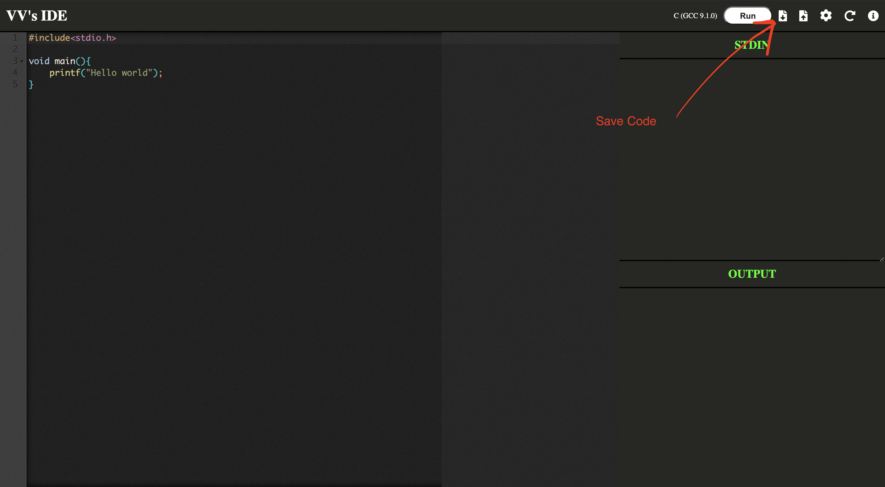
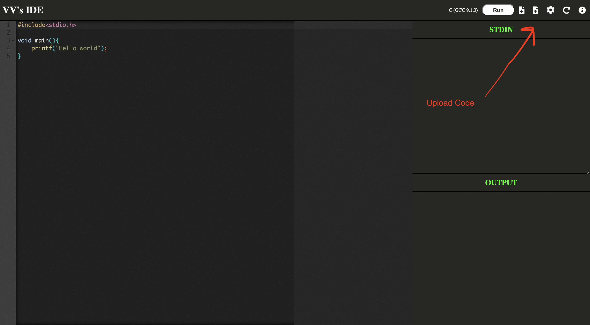

# **Welcome to VV's IDE**

### Useful Links:-
[Live Demo](http://oswalgopal.github.io/ide)
[About Me](http://oswalgopal.github.io)

### About IDE
<a href="#feature1">`1. Compile your code and see output.`</a>

<a href="#feature2">`2. Customize your IDE.`</a>

<a href="#feature3">`3. Save your code on local.`</a>

<a href="#feature4">`4. Upload code from local.`</a>

# 1. Compile your code and see output :-
You can compile your code using **"Run"** button placed on top right of the header. You can also add custom input using the stdin box and your output is shown at output box.

# 2. Customize your IDE :-
You can change language, theme, font-size, tab-size, text-color and font-color from settings.

# 3. Save your code to local system :-
You can use save file icon to save your code onto the local system. The extension of the file is automatically selected on the basis programming language you chosen.

# 4. Upload your code from local system :-
You can use upload file icon to upload your code from the local system. You can only select the files of selected language means can only select .c file for c language.

